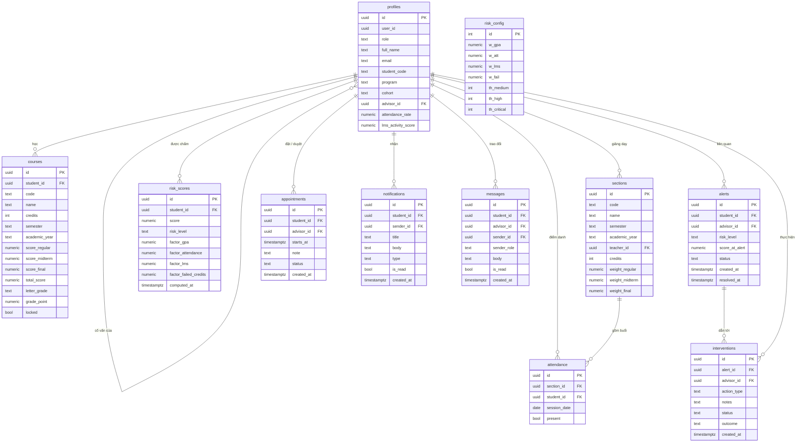
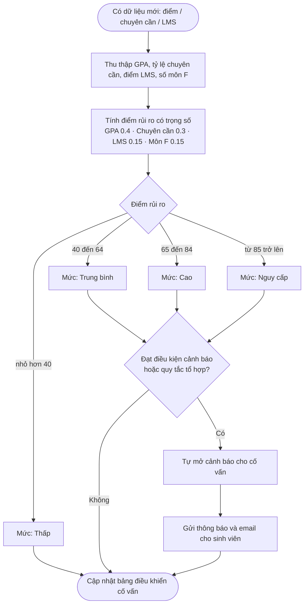
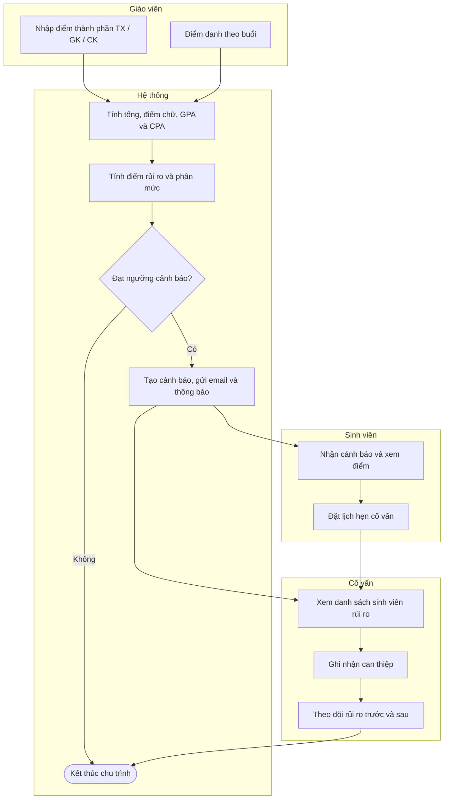
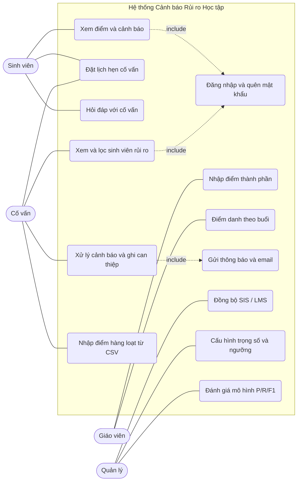
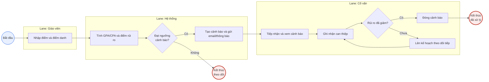

# Sơ đồ hệ thống — Cảnh báo Rủi ro Học tập (Student Alert System · VNU-IS)

Bộ 5 sơ đồ vẽ bằng **Mermaid** (render tự động trên GitHub, VS Code, mermaid.live). Bám sát schema thật (11 bảng Postgres/Supabase) và các luồng nghiệp vụ của ứng dụng.

- Trọng số rủi ro: **GPA 0.4 · Chuyên cần 0.3 · LMS 0.15 · Môn F 0.15**; ngưỡng mức: **40 / 65 / 85** (Trung bình / Cao / Nguy cấp).
- Điểm thành phần: **TX 0.2 · GK 0.3 · CK 0.5**.

---

## 1. ERD — Sơ đồ quan hệ thực thể (Cơ sở dữ liệu)

> `profiles` là bảng trung tâm cho cả 4 vai trò (student / teacher / advisor / manager); `advisor_id` là khóa ngoại tự tham chiếu (cố vấn ↔ sinh viên). `risk_config` là bảng cấu hình đơn (một dòng, id = 1).

---

## 2. Flowchart — Thuật toán chấm rủi ro & phát cảnh báo

> Quy tắc tổ hợp (early signals): GPA tụt mạnh giữa 2 kỳ, trượt ≥ 2 môn, chuyên cần < 75%, hoặc LMS < 40 — có thể phát cảnh báo ngay cả khi điểm tổng chưa cao.

---

## 3. Activity diagram có Swimlane — Quy trình end-to-end theo vai trò

> Bốn làn (lane): **Giáo viên → Hệ thống → Cố vấn / Sinh viên**. Mermaid dùng `subgraph` để mô phỏng swimlane; mũi tên bắc cầu giữa các làn thể hiện dòng công việc.

---

## 4. Use Case diagram — Tác nhân & chức năng

> Mermaid không có ký hiệu Use Case UML gốc (người que + hình bầu dục), nên đây là bản mô phỏng bằng flowchart. Muốn bản UML chuẩn: dán logic này vào **PlantUML** hoặc **draw.io**.

---

## 5. BPMN — Quy trình cảnh báo & can thiệp (pool / lane, gateway, sự kiện)

> BPMN-style dựng bằng Mermaid: **pool/lane** = `subgraph`, **gateway** = hình thoi, **sự kiện đầu/cuối** = hình tròn (viền mảnh = start, viền đậm = end). Muốn file **BPMN 2.0 chuẩn** (mở bằng Camunda/Signavio): tái dựng luồng này trong **bpmn.io** hoặc **draw.io** (đều có mẫu BPMN).
